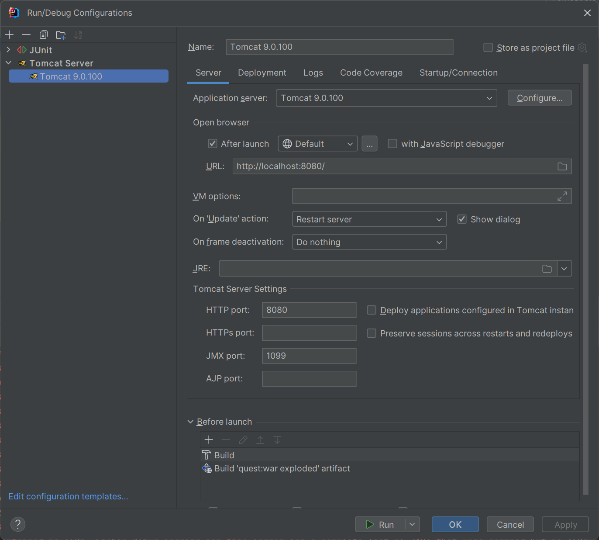
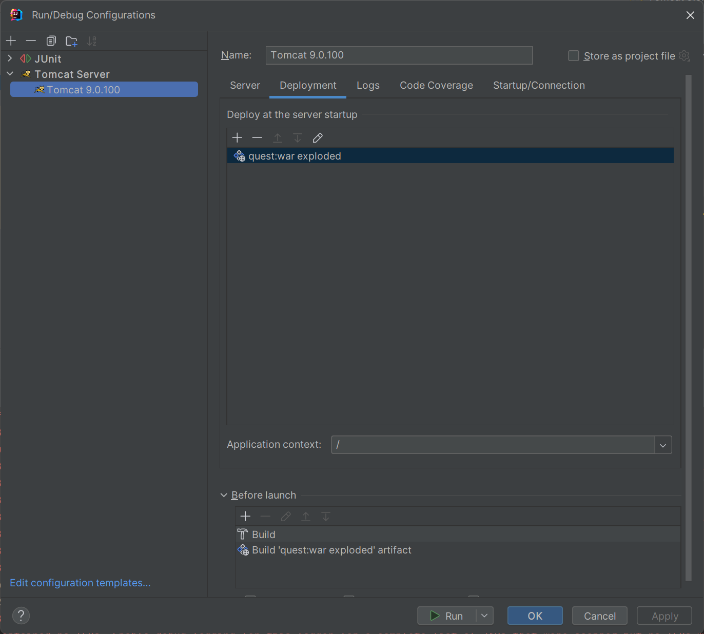

# Quest
javarush, финальное задание модуля 3

## Сборка
Для сборки приложения необходимо выполнить команду <code>mvn clean install</code>

## Run configuration
1. Создать конфигурацию запуска Tomcat, указав каталог, где развёрнут Tomcat
   
2. Указать Application context "/", и Deploy at the server startup - quest:war exploded
   

## Деплой на отдельно установленный Tomcat
Распаковать quest.war в каталог Tomcat \webapps\ROOT